# FieldIQ — Database Design

> **Schema type:** Relational (PostgreSQL target)
> **Status:** Design spec — no ORM or migration files exist yet
> **Last updated:** 2026-03-27

> This document defines the intended production database schema for FieldIQ. The current prototype
> uses flat mock JSON files; this spec describes what the real schema should look like when a
> backend is introduced. Gaps between mock data and this spec are called out at the bottom.

---

## Entity-Relationship Diagram

```mermaid
erDiagram
    USER {
        uuid id PK
        string email UK
        string name
        string initials
        string role "agent | manager | executive"
        string status "active | inactive"
        timestamp createdAt
    }

    AGENT_PROFILE {
        uuid id PK
        uuid userId FK
        uuid teamId FK
        string territory
        string title
        decimal monthlyBudget
        int currentStreak
    }

    MANAGER_PROFILE {
        uuid id PK
        uuid userId FK
        uuid teamId FK
        string region
        string title
        string company
    }

    EXECUTIVE_PROFILE {
        uuid id PK
        uuid userId FK
        string title
        string orgScope
    }

    TEAM {
        uuid id PK
        uuid managerId FK
        string name
        string company
        timestamp createdAt
    }

    TEAM_MEMBER {
        uuid teamId FK
        uuid agentId FK
        timestamp joinedAt
    }

    CONTACT {
        uuid id PK
        uuid agentId FK
        string name
        string initials
        string company
        string jobTitle
        string type "referral_agent | sponsor | lender | attorney | inspector | other"
        string email UK
        string phone
        string address
        int score
        int closings
        string tags
        timestamp createdAt
    }

    SCORE_BREAKDOWN {
        uuid id PK
        uuid contactId FK
        string recency "high | medium | low"
        string frequency "high | medium | low"
        string diversity "high | medium | low"
        string engagement "high | medium | low"
        timestamp computedAt
    }

    ACTIVITY {
        uuid id PK
        uuid agentId FK
        uuid contactId FK
        uuid sponsorId FK
        string type "lunch | pop_by | ce_class | coffee | closing_gift | call | sponsorship | other"
        date date
        string time
        text notes
        decimal spend
        string status "logged | complete | follow_up"
        string label
        boolean isSponsored
        string receiptUrl
        timestamp createdAt
    }

    FOLLOW_UP {
        uuid id PK
        uuid activityId FK
        uuid agentId FK
        uuid contactId FK
        date dueDate
        text note
        string status "pending | complete | cancelled"
        timestamp completedAt
        timestamp createdAt
    }

    CONTRACT {
        uuid id PK
        uuid agentId FK
        uuid contactId FK
        string title
        string transactionType "purchase | refinance | commercial | exchange | other"
        string status "initiated | pending | updated | closed | cancelled"
        decimal amount
        string propertyAddress
        date expectedClosingDate
        date actualClosingDate
        string closingPlatform "qualia | softpro | other"
        string externalOrderId
        text notes
        timestamp createdAt
    }

    BUDGET {
        uuid id PK
        uuid agentId FK
        string periodType "monthly | quarterly | annual | custom"
        date startDate
        date endDate
        decimal amount
        timestamp createdAt
    }

    ALERT {
        uuid id PK
        uuid recipientId FK
        uuid subjectAgentId FK
        string type "below_target | overdue_followup | no_activity | contract_closing | contract_closed"
        text message
        string entityType "activity | contract | follow_up | agent"
        string entityId
        boolean read
        timestamp createdAt
    }

    PERFORMANCE_SNAPSHOT {
        uuid id PK
        uuid agentId FK
        string period "mtd | qtd | ytd"
        date periodStart
        date periodEnd
        int totalActivities
        decimal totalSpend
        int contactsTouched
        int score
        int activitiesDelta
        timestamp computedAt
    }

    USER ||--o| AGENT_PROFILE : "has"
    USER ||--o| MANAGER_PROFILE : "has"
    USER ||--o| EXECUTIVE_PROFILE : "has"
    TEAM ||--o{ TEAM_MEMBER : "includes"
    USER ||--o{ TEAM_MEMBER : "belongs to"
    USER ||--|| TEAM : "manages"
    USER ||--o{ CONTACT : "owns"
    USER ||--o{ ACTIVITY : "logs"
    USER ||--o{ FOLLOW_UP : "tracks"
    USER ||--o{ CONTRACT : "manages"
    USER ||--o{ BUDGET : "allocated"
    USER ||--o{ PERFORMANCE_SNAPSHOT : "tracked in"
    USER ||--o{ ALERT : "receives"
    CONTACT ||--o| SCORE_BREAKDOWN : "scored by"
    CONTACT ||--o{ ACTIVITY : "subject of"
    CONTACT ||--o{ ACTIVITY : "sponsors"
    CONTACT ||--o{ CONTRACT : "party to"
    CONTACT ||--o{ FOLLOW_UP : "linked to"
    ACTIVITY |o--o| FOLLOW_UP : "generates"
```

---

## Overview

FieldIQ is a field sales intelligence platform for the title insurance industry. The schema centers on a **title agent** who builds a book of **contacts** (real estate professionals and sponsors), logs **activities** (touchpoints like lunches, pop-bys, and CE classes), manages outstanding **follow-ups**, and tracks title insurance **contracts** from initiation through closing.

**Managers** oversee a **team** of agents, view aggregated performance, receive **alerts** when agents fall below targets, and review all contracts across their team. **Executives** have a company-wide read-only view.

All performance data is sliceable by period (MTD / QTD / YTD) via **performance snapshots** — pre-computed rollups that power dashboard KPIs without expensive real-time aggregation.

---

## Role & Auth Layer

### USER
> Central identity record. Every person in the system — agent, manager, or executive — has exactly one USER row. Role is stored here as a discriminator; role-specific fields live in the corresponding profile table.

| Field | Type | Constraints | Notes |
|-------|------|-------------|-------|
| id | uuid | PK | Auto-generated |
| email | string | UK, required | Login credential |
| name | string | required | Full display name |
| initials | string | required | 2-letter display abbreviation |
| role | enum | required | `agent` \| `manager` \| `executive` |
| status | enum | required | `active` \| `inactive` — soft delete |
| createdAt | timestamp | required | Account creation time |

---

### AGENT_PROFILE
> Role-specific fields for users with `role = "agent"`. One row per agent user. The agent's performance budget, territory, and team membership live here.

| Field | Type | Constraints | Notes |
|-------|------|-------------|-------|
| id | uuid | PK | Auto-generated |
| userId | uuid | FK → USER, UK | 1:1 with USER |
| teamId | uuid | FK → TEAM, nullable | Null until assigned to a team |
| territory | string | required | Geographic territory, e.g. `"Buckhead"` |
| title | string | required | Job title, e.g. `"Senior Title Agent"` |
| monthlyBudget | decimal | required | Spending ceiling per month in dollars |
| currentStreak | int | required | Consecutive days with at least one logged activity |

---

### MANAGER_PROFILE
> Role-specific fields for users with `role = "manager"`. One row per manager user.

| Field | Type | Constraints | Notes |
|-------|------|-------------|-------|
| id | uuid | PK | Auto-generated |
| userId | uuid | FK → USER, UK | 1:1 with USER |
| teamId | uuid | FK → TEAM | The team this manager oversees |
| region | string | required | Geographic region, e.g. `"Atlanta Metro"` |
| title | string | required | Job title, e.g. `"Regional Sales Manager"` |
| company | string | required | Company name, e.g. `"Premier Title Agency"` |

---

### EXECUTIVE_PROFILE
> Role-specific fields for users with `role = "executive"`. Stub entity — executives see company-wide data but have no unique behavioral fields yet.

| Field | Type | Constraints | Notes |
|-------|------|-------------|-------|
| id | uuid | PK | Auto-generated |
| userId | uuid | FK → USER, UK | 1:1 with USER |
| title | string | required | Job title, e.g. `"VP of Operations"` |
| orgScope | string | required | Scope of visibility, e.g. `"company-wide"` |

---

## Team Structure

### TEAM
> A team of title agents managed by one manager. Teams belong to a company. A manager owns exactly one team; agents belong to exactly one team.

| Field | Type | Constraints | Notes |
|-------|------|-------------|-------|
| id | uuid | PK | Auto-generated |
| managerId | uuid | FK → USER | Must be a user with `role = "manager"` |
| name | string | required | Team name, e.g. `"Atlanta North Team"` |
| company | string | required | Parent company name |
| createdAt | timestamp | required | |

---

### TEAM_MEMBER
> Join table linking agents to their team. An agent belongs to exactly one team at a time; the join table enables history tracking if team reassignments need to be audited.

| Field | Type | Constraints | Notes |
|-------|------|-------------|-------|
| teamId | uuid | FK → TEAM | Composite PK with agentId |
| agentId | uuid | FK → USER | Must be a user with `role = "agent"` |
| joinedAt | timestamp | required | When the agent joined this team |

---

## Contact Layer

### CONTACT
> A person in an agent's relationship book — either a real estate professional (referral source) or a sponsor (partner who co-funds activities). Contacts belong to a single agent. `type` drives UI behavior: sponsors can be applied to activities; referral agents drive the relationship score and contract attribution.

| Field | Type | Constraints | Notes |
|-------|------|-------------|-------|
| id | uuid | PK | Auto-generated |
| agentId | uuid | FK → USER | Owning agent — must have `role = "agent"` |
| name | string | required | Full name |
| initials | string | required | 2-letter display abbreviation |
| company | string | required | Employer or brokerage |
| jobTitle | string | required | Title at company, e.g. `"Realtor"`, `"Mortgage Broker"` |
| type | enum | required | `referral_agent` \| `sponsor` \| `lender` \| `attorney` \| `inspector` \| `other` |
| email | string | UK per agent | Email address |
| phone | string | required | Phone number |
| address | string | nullable | Office or mailing address |
| score | int | required | Relationship health score 0–100 (computed or stored) |
| closings | int | required | Number of closed title transactions attributed to this contact |
| tags | string | required | JSON array of free-form tag strings |
| createdAt | timestamp | required | |

---

### SCORE_BREAKDOWN
> The four-dimension breakdown behind a contact's relationship score. One row per contact, recomputed on each qualifying event (new activity, time elapsed, etc.). Only meaningful for `type = "referral_agent"` contacts.

| Field | Type | Constraints | Notes |
|-------|------|-------------|-------|
| id | uuid | PK | Auto-generated |
| contactId | uuid | FK → CONTACT, UK | 1:1 with CONTACT |
| recency | enum | required | `high` \| `medium` \| `low` — how recently engaged |
| frequency | enum | required | `high` \| `medium` \| `low` — how often engaged |
| diversity | enum | required | `high` \| `medium` \| `low` — variety of activity types |
| engagement | enum | required | `high` \| `medium` \| `low` — quality of engagement |
| computedAt | timestamp | required | When this breakdown was last recalculated |

---

## Activity Layer

### ACTIVITY
> A single field sales touchpoint logged by an agent. The core transactional entity of the platform. Activities can be against a specific contact or a group event (CE class, sponsorship) with `contactId = null`. If an activity is co-funded by a sponsor, `isSponsored = true` and `sponsorId` points to the sponsor contact.

| Field | Type | Constraints | Notes |
|-------|------|-------------|-------|
| id | uuid | PK | Auto-generated |
| agentId | uuid | FK → USER | Logging agent |
| contactId | uuid | FK → CONTACT, nullable | Null for group events (CE class, sponsorship) |
| sponsorId | uuid | FK → CONTACT, nullable | Sponsor contact — must be `type = "sponsor"` when set |
| type | enum | required | `lunch` \| `pop_by` \| `ce_class` \| `coffee` \| `closing_gift` \| `call` \| `sponsorship` \| `other` |
| date | date | required | Date of the activity `YYYY-MM-DD` |
| time | string | required | Wall-clock time, e.g. `"12:30 PM"` |
| notes | text | required | Free-text notes from the agent |
| spend | decimal | required | Cost in dollars (0 for calls/free events) |
| status | enum | required | `logged` \| `complete` \| `follow_up` |
| label | string | nullable | Optional custom display label |
| isSponsored | boolean | required | Whether a sponsor co-funded this activity |
| receiptUrl | string | nullable | URL to uploaded receipt image or PDF |
| createdAt | timestamp | required | |

---

## Follow-up Layer

### FOLLOW_UP
> A pending action item attached to an activity (or created standalone). Tracks what needs to happen next after a touchpoint — e.g., "Send CE class invite by Friday". Follow-ups have their own lifecycle (`pending → complete / cancelled`) independent of the source activity's status.

| Field | Type | Constraints | Notes |
|-------|------|-------------|-------|
| id | uuid | PK | Auto-generated |
| activityId | uuid | FK → ACTIVITY, nullable | Source activity — null for standalone follow-ups |
| agentId | uuid | FK → USER | Owning agent |
| contactId | uuid | FK → CONTACT, nullable | Contact this follow-up is about |
| dueDate | date | required | When the follow-up action is due |
| note | text | required | Description of the required action |
| status | enum | required | `pending` \| `complete` \| `cancelled` |
| completedAt | timestamp | nullable | When status was set to `complete` |
| createdAt | timestamp | required | |

---

## Contract Layer

### CONTRACT
> A title insurance transaction tracked from initiation through closing. Each contract is owned by one agent and linked to one contact (typically the referring real estate agent). The `closingPlatform` and `externalOrderId` fields are reserved for future integration with title closing software (Qualia, SoftPro).

| Field | Type | Constraints | Notes |
|-------|------|-------------|-------|
| id | uuid | PK | Auto-generated |
| agentId | uuid | FK → USER | Agent managing this transaction |
| contactId | uuid | FK → CONTACT | The referring contact (real estate agent) |
| title | string | required | Human-readable deal description, e.g. `"245 Peachtree Rd NE — Purchase"` |
| transactionType | enum | required | `purchase` \| `refinance` \| `commercial` \| `exchange` \| `other` |
| status | enum | required | `initiated` \| `pending` \| `updated` \| `closed` \| `cancelled` |
| amount | decimal | required | Deal value in dollars |
| propertyAddress | string | nullable | Property address for the transaction |
| expectedClosingDate | date | nullable | Projected closing date |
| actualClosingDate | date | nullable | Actual closing date — set when `status = "closed"` |
| closingPlatform | enum | nullable | `qualia` \| `softpro` \| `other` — for title software integration |
| externalOrderId | string | nullable | Order/file ID from external closing platform |
| notes | text | nullable | Free-text notes |
| createdAt | timestamp | required | |

---

## Supporting Entities

### BUDGET
> A spending ceiling allocated to an agent for a defined period. Multiple budget records can exist per agent (monthly + quarterly, or custom date ranges). The agent dashboard computes `spent / amount` to show budget utilization.

| Field | Type | Constraints | Notes |
|-------|------|-------------|-------|
| id | uuid | PK | Auto-generated |
| agentId | uuid | FK → USER | Budget owner |
| periodType | enum | required | `monthly` \| `quarterly` \| `annual` \| `custom` |
| startDate | date | required | Period start |
| endDate | date | required | Period end |
| amount | decimal | required | Budget ceiling in dollars |
| createdAt | timestamp | required | |

---

### ALERT
> A system-generated notification for a manager (or agent) about a performance or action event. Managers receive alerts when agents fall below activity targets or have no recent activity. Agents can receive alerts about overdue follow-ups or upcoming contract closings.

| Field | Type | Constraints | Notes |
|-------|------|-------------|-------|
| id | uuid | PK | Auto-generated |
| recipientId | uuid | FK → USER | Who sees this alert (manager or agent) |
| subjectAgentId | uuid | FK → USER, nullable | Which agent the alert is about (for manager alerts) |
| type | enum | required | `below_target` \| `overdue_followup` \| `no_activity` \| `contract_closing` \| `contract_closed` |
| message | text | required | Human-readable alert text |
| entityType | string | nullable | The entity this alert relates to: `activity` \| `contract` \| `follow_up` \| `agent` |
| entityId | uuid | nullable | FK to the related entity row |
| read | boolean | required | Whether the recipient has dismissed/read the alert |
| createdAt | timestamp | required | |

---

### PERFORMANCE_SNAPSHOT
> Pre-computed rollup of an agent's performance metrics for a given period. Recomputed nightly (or on-demand) to avoid expensive real-time aggregations on the dashboard. One row per agent per period; the `computedAt` timestamp indicates freshness.

| Field | Type | Constraints | Notes |
|-------|------|-------------|-------|
| id | uuid | PK | Auto-generated |
| agentId | uuid | FK → USER | The agent this snapshot is for |
| period | enum | required | `mtd` \| `qtd` \| `ytd` |
| periodStart | date | required | Start of the period window |
| periodEnd | date | required | End of the period window |
| totalActivities | int | required | Total activities logged in the period |
| totalSpend | decimal | required | Total dollars spent in the period |
| contactsTouched | int | required | Unique contacts with at least one activity |
| score | int | required | Aggregate relationship health score (0–100) |
| activitiesDelta | int | required | % change vs. same period prior cycle |
| computedAt | timestamp | required | When this snapshot was last recalculated |

---

## Relationships

**Users and roles:** Every person is a `USER`. Role-specific fields live in `AGENT_PROFILE`, `MANAGER_PROFILE`, or `EXECUTIVE_PROFILE` — exactly one profile per user. This avoids a fat user table while keeping queries simple (single join to get any user's full record).

**Teams:** A `MANAGER_PROFILE` owns exactly one `TEAM`. Agents are linked to their team via `TEAM_MEMBER` (join table), enabling team reassignment history. The `managerId` FK on `TEAM` allows direct lookup of who manages a team without going through the member table.

**Contact ownership:** Each `CONTACT` is owned by one agent (`agentId` FK). Contacts are private to the agent's book — two agents can have the same real estate professional in their separate books. Contacts of `type = "sponsor"` can be referenced in `ACTIVITY.sponsorId` to attribute co-funding; all other contact types can be referenced in `ACTIVITY.contactId` as the subject.

**Activities:** An `ACTIVITY` always belongs to one agent. It optionally targets one contact (`contactId` — null for group events like CE classes) and optionally credits one sponsor contact (`sponsorId` — only set when `isSponsored = true`). This means `CONTACT` has two distinct FK relationships back to `ACTIVITY`: one as subject, one as sponsor.

**Follow-ups:** A `FOLLOW_UP` is optionally derived from an `ACTIVITY` (via `activityId`) but can also be created standalone. Both the activity's `status = "follow_up"` flag and the `FOLLOW_UP` table need to stay in sync: when an activity is logged with follow-up intent, a `FOLLOW_UP` row is created. When the follow-up is resolved, both `FOLLOW_UP.status` and the source `ACTIVITY.status` are updated.

**Contracts:** A `CONTRACT` belongs to one agent and is attributed to one contact (the referring agent who sent the deal). The `closingPlatform` + `externalOrderId` fields are reserved for future Qualia/SoftPro integration — a webhook from the closing platform can auto-update contract status and closing date.

**Alerts:** `ALERT` has two FK relationships back to `USER`: `recipientId` (who sees it) and `subjectAgentId` (who it's about). A manager receives alerts about their agents; an agent may receive alerts about their own overdue follow-ups. The `entityType` + `entityId` pair is a polymorphic reference to the related record (activity, contract, follow-up, or agent).

**Performance Snapshots:** `PERFORMANCE_SNAPSHOT` is a cache table — it holds pre-aggregated metrics derived from `ACTIVITY`, `CONTRACT`, and `CONTACT` records. It is read-only from the application layer; only a background job writes to it.

---

## Enum Reference

| Entity | Field | Values |
|--------|-------|--------|
| USER | role | `agent` \| `manager` \| `executive` |
| USER | status | `active` \| `inactive` |
| CONTACT | type | `referral_agent` \| `sponsor` \| `lender` \| `attorney` \| `inspector` \| `other` |
| SCORE_BREAKDOWN | recency / frequency / diversity / engagement | `high` \| `medium` \| `low` |
| ACTIVITY | type | `lunch` \| `pop_by` \| `ce_class` \| `coffee` \| `closing_gift` \| `call` \| `sponsorship` \| `other` |
| ACTIVITY | status | `logged` \| `complete` \| `follow_up` |
| FOLLOW_UP | status | `pending` \| `complete` \| `cancelled` |
| CONTRACT | transactionType | `purchase` \| `refinance` \| `commercial` \| `exchange` \| `other` |
| CONTRACT | status | `initiated` \| `pending` \| `updated` \| `closed` \| `cancelled` |
| CONTRACT | closingPlatform | `qualia` \| `softpro` \| `other` |
| BUDGET | periodType | `monthly` \| `quarterly` \| `annual` \| `custom` |
| ALERT | type | `below_target` \| `overdue_followup` \| `no_activity` \| `contract_closing` \| `contract_closed` |
| PERFORMANCE_SNAPSHOT | period | `mtd` \| `qtd` \| `ytd` |

---

## Mock Data → Production Schema Mapping

The current prototype uses flat JSON files. Here's how each file maps to this schema:

| Mock file | Maps to | Gap |
|-----------|---------|-----|
| `agents.json` | `USER` + `AGENT_PROFILE` + `PERFORMANCE_SNAPSHOT` | Single record; no email, no teamId |
| `contacts.json` | `CONTACT` + `SCORE_BREAKDOWN` | Missing `agentId` FK; `type` values need remapping |
| `activities.json` | `ACTIVITY` | Missing `agentId` and hard `contactId` FKs; missing `receiptUrl` |
| `contracts.json` | `CONTRACT` | `agentName` string → needs `agentId` FK; missing `transactionType`, `propertyAddress` |
| `team.json` | `TEAM` + `TEAM_MEMBER` + `PERFORMANCE_SNAPSHOT` (team rollups) + `ALERT` | Flat aggregation; not normalized to agents table |
| `agent-kpis.json` | `PERFORMANCE_SNAPSHOT` + derived from `ACTIVITY` | Should be computed, not stored as a static file |
| Follow-ups page hardcode | `FOLLOW_UP` | No mock file; needs `lib/mock-data/follow-ups.json` |
| Performance page hardcode | `PERFORMANCE_SNAPSHOT` | No mock file; needs `lib/mock-data/monthly-trends.json` |
